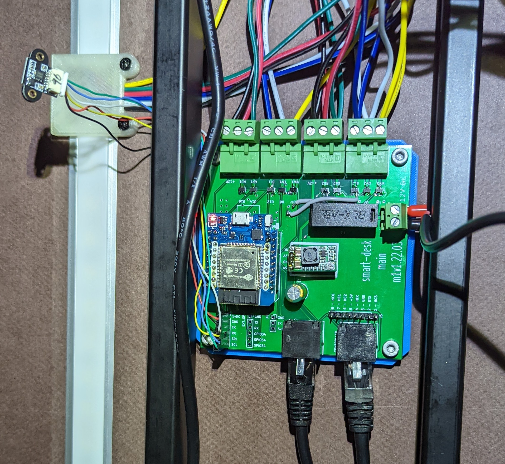

# smart-desk-pcb

If you want to edit the pcb, the KiCad 6 files are included subject to [the license terms](../LICENSE.md).

The ESP32 module comes from [this](https://github.com/r0oland/ESP32_mini_KiCad_Library) library. Thanks to [r0oland](https://github.com/r0oland) for that library!

## BOM

The primary components on the PCB are:

- [D1 Mini style ESP32 chip](https://www.aliexpress.com/item/2251832633593063.html)
- [Configurable DC Buck converter module](https://www.aliexpress.com/item/32833398811.html). This steps the 12V dc from the KVM power supply down to the 5V for the ESP32 module.
- [RJ45 Jack (LCSC: C385834)](https://lcsc.com/product-detail/Ethernet-Connectors-Modular-Connectors-RJ45-RJ11_Ckmtw-Shenzhen-Cankemeng-R-RJ45R08P-A004_C385834.html). Footprint for this should be included in `jlcpcb.kicad_sym`. Two of theses for easy connection to the Jarvis remote/motor-controller.
- 2x5 ct [Diodes Incorporated DMN1019USN-7 (LCSC: C145103)](https://lcsc.com/product-detail/MOSFETs_Diodes-Incorporated-DMN1019USN-7_C145103.html). I had these handy and with the current ship shortage, it didn't seem worth th effort to try to source better ones. These are optional if you don't want the LED portion of the PCB.
- [Fuse holder (LCSC:C3131)](https://lcsc.com/product-detail/Fuse-Holders_Xucheng-Elec-C3131_C3131.html). Jump this out at your own risk!

There are some additional headers on the PCB for some optional components:

- PIR sensor (wired to ESP `gpio39`). I ended up not using this as I already have sufficient presence detection through other sensors placed around my home.
- An i2c based LIDAR sensor [`tof10120`](https://esphome.io/components/sensor/tof10120.html)) which I am using to measure distance from the desk to chair/person. Inclusion of this sensor was inspired by [this](.https://www.thouters.be/Standingstats.html) post from `Thomas Langewouters`.

## gerber

If you want to make zero changes, the [gerber files are included](./exports/2022-03.26.zip) and are subject to [the license terms](../LICENSE.md).

**Note**: There is a _small_ 'bug' with the v1 PCB: some of the MOSFETS do not have a connection to the ground plain. No, I don't know how this passed DRC. Fortunately, the fix is pretty easy: two small bodge wires connecting the GND pin from `U11` and `U15` to vias which connect to the ground plane.

**Note:** the two grey wires next to the fuse holder.

The gerber files / KiCad project are set up for use with JLCPCB but probably would work as-is with other PCB fab houses, too.

## Enclosure

I have included a STEP file export of the v1 PCB should you need it for PCB mounting hole locations or similar.
