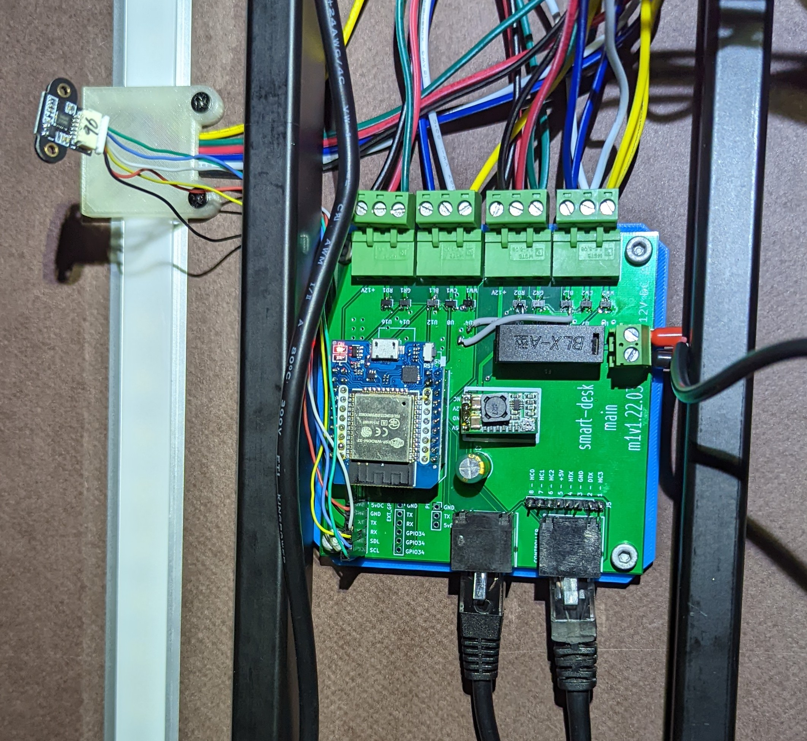

# Jarvis ESPHome

This is an extension / port of the initial reverse engineering work done by [@phord](https://github.com/phord) for the [`Jarvis`](https://github.com/phord/Jarvis) repo.
Rather than build everything from scratch, I have ported most of the functionality to an ESPHome component.

**Note:** You almost certainly should not use this ESPHome component! Thanks to [@maraid](https://github.com/maraid), more of the [UART has been reverse engineered](https://github.com/maraid/Jarvis#technical-notes). This means that the PCB is out of date and can be re-factored to simply interface with the desk via UART. This theoretically also means that ESPHome can control more aspects of the desk more precisely with fewer wires and a simpler software implementation!

## ESPHome Component

I am not a full time C++ programmer so the code almost certainly does look like a bad copy/paste job.
That's because it largely is! I found a few different "similar" projects and modeled my code off of those.

Details on how to use the custom component with ESPHome can be found in [components/fully_jarvis_cb2c](components/fully_jarvis_cb2c).

## PCB

Inspired by [this](https://github.com/phord/Jarvis/discussions/18) thread, I created a simple PCB to interface with the desk control / motor driver.
I used a more capable ESP32 module specifically so I could drive some RGBWW LED strips as well.

See the [cad](cad/readme.md) folder for the KiCad files.

The (mostly populated) PCB looks like this:

